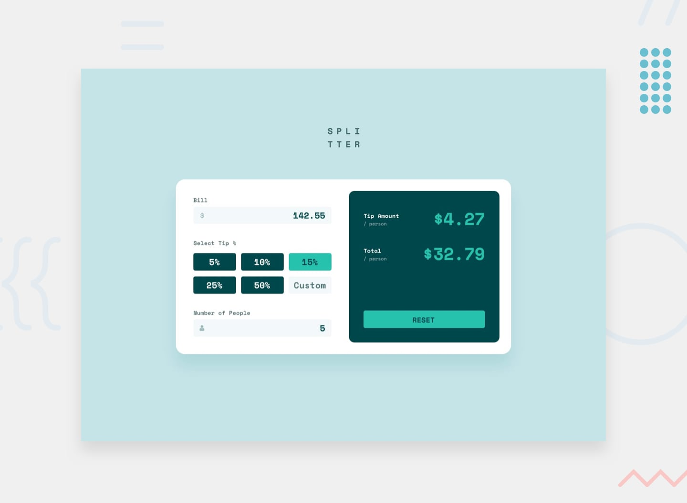

# Frontend Mentor - Tip calculator app solution

This is a solution to the [Tip calculator app challenge on Frontend Mentor](https://www.frontendmentor.io/challenges/tip-calculator-app-ugJNGbJUX). Frontend Mentor challenges help you improve your coding skills by building realistic projects.

## Table of contents

- [Overview](#overview)
  - [The challenge](#the-challenge)
  - [Links](#links)
- [My process](#my-process)
  - [Built with](#built-with)
  - [What I learned](#what-i-learned)
  - [Continued development](#continued-development)
  - [Useful resources](#useful-resources)
- [Author](#author)
- [Acknowledgments](#acknowledgments)

## Overview

### The challenge

Users should be able to:

- View the optimal layout for the app depending on their device's screen size
- See hover states for all interactive elements on the page
- Calculate the correct tip and total cost of the bill per person

### Links

- Solution URL: [https://github.com/KaskaS-O/tip-calculator-app](https://github.com/KaskaS-O/tip-calculator-app)
- Live Site URL: [https://kaskas-o.github.io/tip-calculator-app/](https://kaskas-o.github.io/tip-calculator-app/)

## My process

### Built with

- Semantic HTML5 markup
- CSS custom properties
- Flexbox
- CSS Grid
- Mobile-first workflow

### What I learned

This was my first challenge requiring more js. Handling different sources of data (Tip form) wasn't easy at first. The design of an app required live calculating of and values (Tip per person, Amount per person) which has some difficulties.

### Continued development

I think this app would be good opportunity to practice OOP. It would allow to create more universal functions and components.

## Author

- Website - [KaskaS-O](https://github.com/KaskaS-O)
- Frontend Mentor - [@KaskaS-O](https://www.frontendmentor.io/profile/KaskaS-O)
